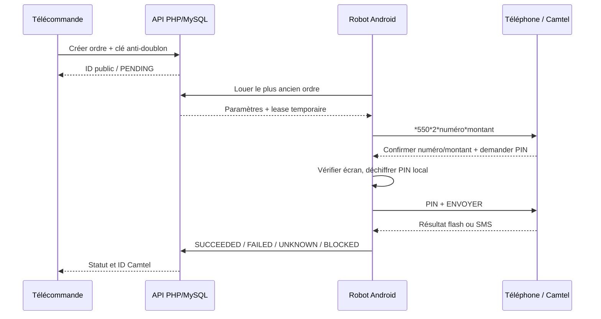

# Architecture du noyau Robot Blue Magic v2

## Décision centrale

Le serveur transporte une intention métier (`REQUEST_SUPPLY`, `SUPPLY_CHILD`, `RETAIL_SALE`) et non un code USSD libre. Il résout les numéros autorisés dans la hiérarchie. Le Robot recalcule ensuite localement la commande avant de la composer.

## Barrières anti-erreur

1. **Hiérarchie serveur** : un DSM ne peut demander qu’à son DAE enregistré; un PoS ne peut demander qu’à son DSM.
2. **Pas d’USSD arbitraire** : seules trois opérations sont admises dans ce noyau.
3. **Idempotence** : une double pression sur le bouton avec la même clé ne crée pas deux ordres.
4. **Lease** : un seul Robot peut réserver un ordre pendant 120 secondes.
5. **Recalcul local** : l’application refuse un `ussd_code` serveur incohérent avec les champs signés.
6. **Vérification du pop-up** : le PIN n’est injecté que si le texte contient le numéro à 9 chiffres et le montant attendus.
7. **Pas de retry financier aveugle** : après composition, un résultat manquant passe à `UNKNOWN`.
8. **Coupe-circuit PIN** : `Wrong PIN code` arrête le Robot dès la première occurrence.
9. **Verrouillage sécurisé** : aucune commande n’est composée derrière un mot de passe ou schéma ; le lease est rendu à la file.
10. **Mutex téléphone** : les profils et SIM partagent une seule session USSD, avec récupération des anciens conflits locaux.
11. **Synchronisation non bloquante** : un résultat à renvoyer au serveur ne bloque jamais les autres profils.

## Consommation réseau et batterie

- location de commande toutes les 30 secondes au repos, accélérée uniquement pendant une transaction ;
- heartbeat toutes les 5 minutes ;
- retour exponentiel jusqu’à 60 secondes après erreur réseau ;
- aucun ping JavaScript toutes les 4 secondes ;
- WakeLock processeur et écran uniquement pendant une transaction, limités à 135 secondes ;
- notification permanente lorsque le mode Robot est actif.

## Compatibilité

- Android 6 à 7 : `ACTION_CALL` + service d’accessibilité ;
- Android 8 et plus : même chemin pour conserver une session interactive visible et contrôlable ;
- Android 5 : volontairement exclu de cette première version robuste, car le stockage AES/GCM du PIN dans Android Keystore est garanti à partir d’Android 6 ;
- téléphone Robot recommandé : jusqu’à deux SIM testées, pas de verrouillage écran sécurisé pendant le service, chargeur permanent, optimisation batterie désactivée.

## Pourquoi pas `sendUssdRequest()` seul ?

L’API, ajoutée au niveau 26, renvoie une réponse ou un échec à une requête USSD. Elle n’expose pas de méthode publique documentée permettant d’envoyer la réponse suivante dans la même session interactive. La fenêtre Camtel montrée dans le cahier des charges exige donc l’automatisation contrôlée du dialogue système.
